# 🛡️ SOC-Nemotron-CLI

[](LICENSE)
[](PLATFORM_SUPPORT.md)
[](https://opencode.ai)
[](https://build.nvidia.com/explore/discover)
[](https://github.com/amitambekar510/SOC-Nemotron-CLI/stargazers)

---

<p align="center">
  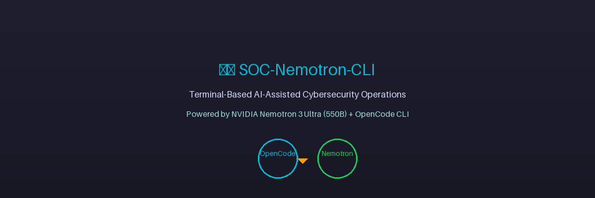
</p>

<p align="center">
  <strong>Terminal-Based AI-Assisted Cybersecurity Operations</strong><br />
  Powered by <strong>NVIDIA Nemotron 3 Ultra (550B)</strong> + <strong>OpenCode CLI</strong>
</p>

<p align="center">
  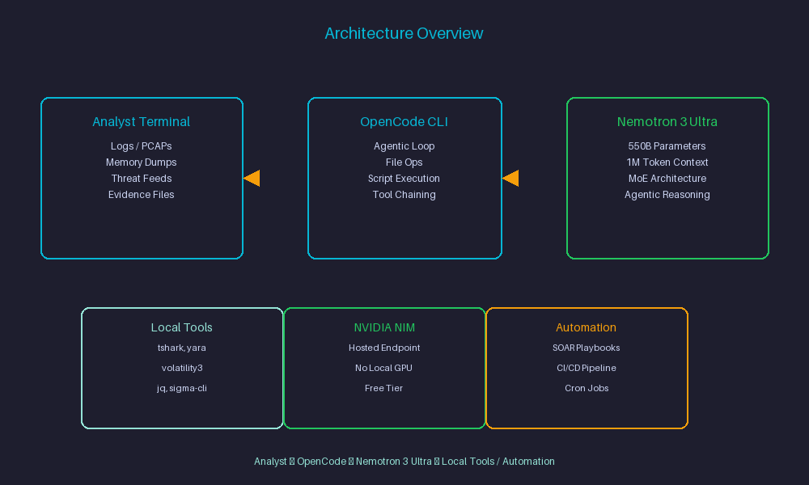
</p>

---

## 📑 Table of Contents

- [Quick Start (5 min)](#-quick-start-5-min)
- [About This Project](#-about-this-project)
- [Why This Stack](#-why-this-stack)
- [Platform Support](#-platform-support)
- [Repository Structure](#-repository-structure)
- [Skill-Level Operational Mapping](#-skill-level-operational-mapping)
- [Setup & Authentication](#-setup--authentication-macos)
- [Verify Your Installation](#-verify-your-installation)
- [Prompt Templates (Copy → Edit → Run)](#-prompt-templates-copy--edit--run)
- [Common Mistakes & Fixes](#-common-mistakes--fixes)
- [Learning Path (Week-by-Week)](#-learning-path-week-by-week)
- [Example Prompts by Use Case](#-example-prompts-by-use-case)
- [Sample Output (Illustrative)](#-sample-output-illustrative)
- [Rate Limits & Cost Notes](#-rate-limits--cost-notes)
- [Troubleshooting](#-troubleshooting-macos)
- [When NOT to Use This Stack](#-when-not-to-use-this-stack)
- [Uninstall / Disconnect](#-uninstall--disconnect)
- [Security & Operational Guidelines](#-security--operational-guidelines)
- [Official Reference Links](#-official-reference-links)
- [Roadmap](#-roadmap)
- [Contributing](#-contributing)
- [Source & Learning Notes](#-source--learning-notes)
- [Author](#-author)
- [License](#-license)

---

## 🚀 Quick Start (5 min)

<p align="center">
  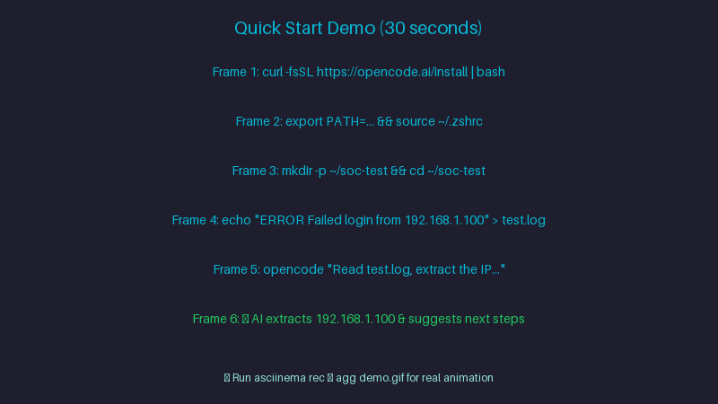
</p>

```bash
# 1. Install OpenCode CLI
curl -fsSL https://opencode.ai/install | bash
echo 'export PATH=/Users/$USER/.opencode/bin:$PATH' >> ~/.zshrc && source ~/.zshrc

# 2. Get your NVIDIA API key → https://build.nvidia.com/explore/discover

# 3. Test in 30 seconds
mkdir -p ~/soc-test && cd ~/soc-test
echo "2024-01-15 10:30:45 ERROR Failed login from 192.168.1.100 user=admin" > test.log
opencode "Read test.log, extract the IP, and tell me what to check next"
```

**Expected:** OpenCode reads the log, extracts `192.168.1.100`, and suggests checking firewall logs, SIEM alerts, and account lockout policies.

---

## 📖 About This Project

<p align="center">
  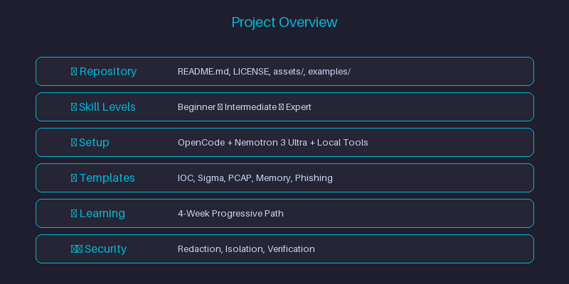
</p>

SOC-Nemotron-CLI is a hands-on operational guide and prompt library for **Security Operations Center (SOC) Analysts, Threat Hunters, Detection Engineers, and Incident Responders** to leverage **NVIDIA Nemotron 3 Ultra (550B)** — a free, hosted, agentic-reasoning LLM — directly from the terminal via **OpenCode CLI**.

This repository was built as part of my personal self-study into emerging AI tooling in the cybersecurity space, documenting how newly released agentic AI CLIs can be applied to real SOC/IR workflows — **log parsing, IOC extraction, detection rule authoring, and memory forensics triage** — all without needing a local GPU.

📚 Compiled and tested for study/reference purposes, based on hands-on setup and a Gemini research conversation export.

---

## 🚀 Why This Stack

<p align="center">
  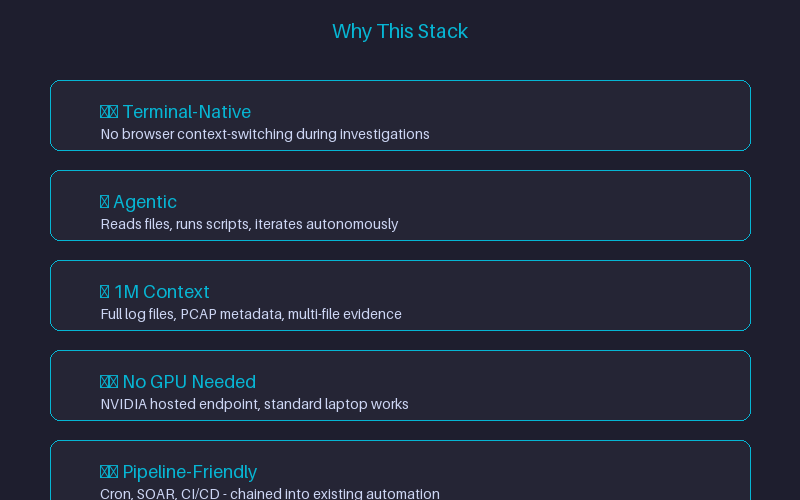
</p>

Most people interact with LLMs by copy-pasting logs into a browser chat window. That breaks flow during an active investigation. This stack is different:

- **Terminal-native** — stays inside the analyst's existing workflow (no context-switching to a browser tab mid-investigation)
- **Agentic, not just chat** — OpenCode can read files, run scripts, iterate on errors, and write output artifacts autonomously (`--loop` mode), not just answer questions
- **1M-token context** — large enough to ingest full log files, PCAP metadata dumps, or multi-file evidence sets in a single pass
- **No local GPU required** — Nemotron 3 Ultra runs on NVIDIA's hosted endpoint, so a standard analyst laptop is enough
- **Scriptable & pipeline-friendly** — CLI-based means it can be chained into existing SOC automation (cron jobs, SOAR playbooks, CI-style triage pipelines) — something a browser chatbot can't do

---

## 💻 Platform Support

⚠️ **Tested on macOS only (as of now)**
This guide, its shell commands (`~/.zshrc`), and setup steps have been written and verified on macOS. Linux and Windows users may need to adapt shell config paths (e.g. `~/.bashrc`) and PATH handling accordingly — this has not yet been tested on those platforms.

| Platform | Status |
|----------|--------|
| 🍎 macOS | ✅ Tested & Documented |
| 🐧 Linux | 🔜 Coming soon — planned for a future update |
| 🪟 Windows | 🔜 Coming soon — planned for a future update |

📌 **Roadmap:** Linux and Windows-specific setup guides (including WSL instructions for Windows) are planned and will be added to this repository in a future update. Stay tuned!

📖 **See also:** [Platform Support Details](PLATFORM_SUPPORT.md) (coming soon)

---

## 📁 Repository Structure

```
SOC-Nemotron-CLI/
├── README.md          → This guide: setup, config, prompts, and operational notes
├── LICENSE            → MIT License
├── assets/            → Screenshots, diagrams, GIFs for documentation
│   ├── hero-banner.png
│   ├── architecture-overview.png
│   ├── quickstart-demo.gif
│   ├── project-overview.png
│   ├── architecture-overview.png
│   ├── quickstart-demo.gif
│   ├── project-overview.png
│   ├── why-this-stack.png
│   ├── opencode-tui.png
│   ├── sigma-output.png
│   ├── memory-forensics.png
│   ├── project-overview.png
│   ├── why-this-stack.png
│   └── ...
├── examples/          → Ready-to-run configs and prompt files
│   ├── opencode.config.json
│   └── prompts/
│       ├── ioc-extraction.md
│       ├── sigma-rule.md
│       ├── memory-forensics.md
│       ├── pcap-analysis.md
│       └── phishing-analysis.md
└── scripts/           → Reference implementation scripts (coming soon)
    ├── parse_syslog.py
    ├── generate_sigma.py
    └── volatility_wrapper.py
```

---

## 🎯 Skill-Level Operational Mapping

<p align="center">
  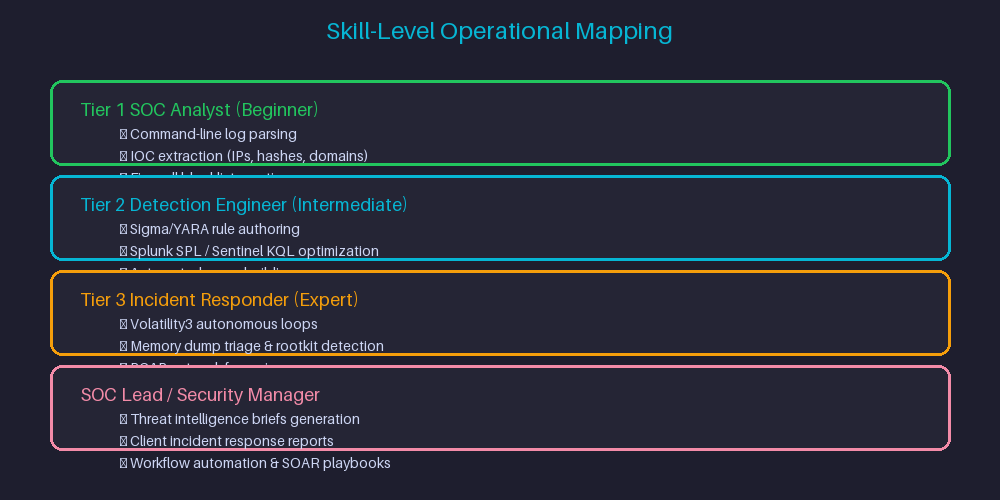
</p>

| Cybersecurity Role / Level | Primary Terminal Capabilities | Target Use Cases |
|----------------------------|------------------------------|------------------|
| **Tier 1 SOC Analyst (Beginner)** | Command-line parsing, log normalization, IOC extraction | Parse Syslog/Event IDs, defang IPs/URLs, create firewall blocklists |
| **Tier 2 Detection Engineer (Intermediate)** | Scripting, query building, automated rule writing | Write & test Sigma/YARA rules, optimize Splunk SPL / Sentinel KQL queries |
| **Tier 3 Incident Responder (Expert)** | Autonomous script execution, forensic analysis | Run iterative volatility loops, triage memory dumps, parse network PCAPs |
| **SOC Lead / Security Manager** | Workflow automation, documentation generation | Generate threat intelligence briefs, automate client incident response reports |

---

## ⚡ Setup & Authentication (macOS)

### 0. Get Your NVIDIA API Key

<p align="center">
  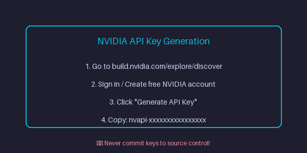
</p>

1. Open the [NVIDIA Nemotron 3 Ultra model page](https://build.nvidia.com/explore/discover) and sign in / create a free NVIDIA account
2. Click **Generate API Key**
3. Copy the key — it looks like `nvapi-xxxxxxxxxxxxxxxx`

⚠️ **Never share your API key publicly or commit it to source control.**

### 1. Install OpenCode CLI

<p align="center">
  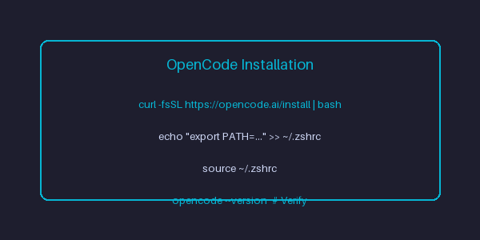
</p>

On your macOS security analysis host:
```bash
curl -fsSL https://opencode.ai/install | bash
```
Or install via npm:
```bash
npm install -g opencode-ai
```
See the official [OpenCode documentation](https://opencode.ai) for details.

### 2. Add OpenCode to Your PATH (macOS zsh default)
```bash
echo 'export PATH=/Users/$USER/.opencode/bin:$PATH' >> ~/.zshrc
source ~/.zshrc
```

🐧 **Linux users:** your default shell config is likely `~/.bashrc` instead of `~/.zshrc` — swap accordingly once the Linux guide is published.

### 3. Launch OpenCode and Connect to NVIDIA NIM

<p align="center">
  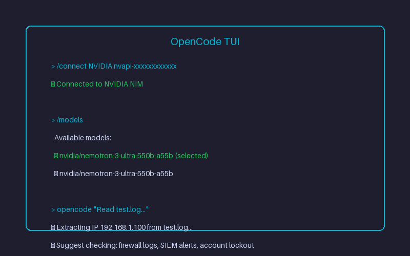
</p>

```bash
# Navigate to your investigation / log directory
cd ~/soc-investigations

# Launch OpenCode TUI
opencode

# Authenticate and select Nemotron 3 Ultra
/connect NVIDIA nvapi-YOUR_NVIDIA_API_KEY
/models  # Select: nvidia/nemotron-3-ultra-550b-a55b
```

### 4. Provider Configuration

Add the following to your OpenCode config (e.g. `opencode.config.json`):
```json
{
  "$schema": "https://opencode.ai/config.json",
  "provider": {
    "nvidia": {
      "npm": "@ai-sdk/openai-compatible",
      "name": "NVIDIA NIM",
      "options": {
        "baseURL": "https://integrate.api.nvidia.com/v1",
        "apiKey": "nvapi-YOUR_NVIDIA_API_KEY"
      },
      "models": {
        "nvidia/nemotron-3-ultra-550b-a55b": {
          "name": "Nemotron 3 Ultra (550B)",
          "limit": {
            "context": 1000000,
            "output": 16384
          }
        }
      }
    }
  }
}
```

Replace `nvapi-YOUR_NVIDIA_API_KEY` with your actual NVIDIA NIM API key. **Never commit real keys to source control** — use environment variables or a secrets manager instead.

### Model Specs at a Glance

| Attribute | Detail |
|-----------|--------|
| **Model ID** | `nvidia/nemotron-3-ultra-550b-a55b` |
| **API Endpoint** | `https://integrate.api.nvidia.com/v1` |
| **Context Window** | Up to 1,000,000 tokens |
| **Total Parameters** | ~550B (NVIDIA lists 561B in endpoint specs) |
| **Active Parameters** | ~55B (MoE-style architecture) |
| **Use Cases** | Agentic reasoning, coding, planning, tool calling, long-context tasks |

---

## ✅ Verify Your Installation

<p align="center">
  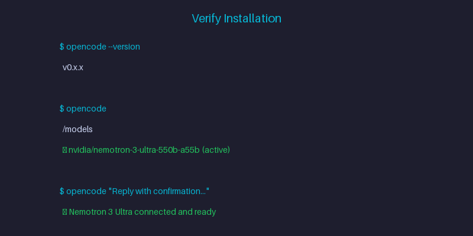
</p>

Before running SOC-specific prompts, confirm everything is wired up correctly:

```bash
# Confirm OpenCode is installed and on PATH
opencode --version

# Confirm the NVIDIA provider is connected and the model is selected
opencode
/models   # nvidia/nemotron-3-ultra-550b-a55b should show as active

# Run a quick smoke-test prompt
opencode "Reply with a one-line confirmation that Nemotron 3 Ultra is connected and ready."
```

If the model responds, your setup is complete and you're ready to move on to the SOC use cases below.

---

## 📋 Prompt Templates (Copy → Edit → Run)

Copy a template, replace the `{{PLACEHOLDERS}}`, and run.

### IOC Extraction & Firewall Blocklist
```bash
opencode "Read {{LOG_FILE}}, extract all {{IOC_TYPE}} (IPs, domains, hashes, emails), defang them (e.g., 192.168.1[.]1), and structure into {{OUTPUT_FILE}}.json"
```

### Sigma Detection Rule Authoring
```bash
opencode "Analyze {{LOG_FILE}} and generate a valid Sigma detection rule targeting {{ATTACK_TECHNIQUE}} with MITRE ATT&CK mapping. Include detection logic, false positive considerations, and test cases."
```

### Log Parsing Script Generator
```bash
opencode "Write a Python script to parse {{LOG_FORMAT}} logs, extract {{FIELD_LIST}}, and output CSV. Handle {{EDGE_CASES}}. Save as parse_{{LOG_TYPE}}.py"
```

### PCAP Metadata Extraction
```bash
opencode "Read {{PCAP_FILE}}, extract conversation summary, top talkers, DNS queries, and suspicious patterns. Output summary as {{OUTPUT_FILE}}.md"
```

### Memory Forensics Triage Script
```bash
opencode "Write a Python script using Volatility3 to parse {{MEMORY_DUMP}} for {{ARTIFACT_TYPE}} (processes, network connections, injected code). Output markdown triage report."
```

### Phishing Email Header Analysis
```bash
opencode "Read {{EML_FILE}}, parse all headers, extract sender IP path, SPF/DKIM/DMARC results, and identify anomalies. Output as {{OUTPUT_FILE}}.json"
```

### Threat Intelligence Brief Generator
```bash
opencode "Read {{IOC_FEED}}, correlate with internal logs in {{LOG_DIR}}, and generate a threat intel brief for {{TIME_PERIOD}} with MITRE ATT&CK mapping. Output as {{OUTPUT_FILE}}.md"
```

---

## ❌ Common Mistakes & Fixes

<p align="center">
  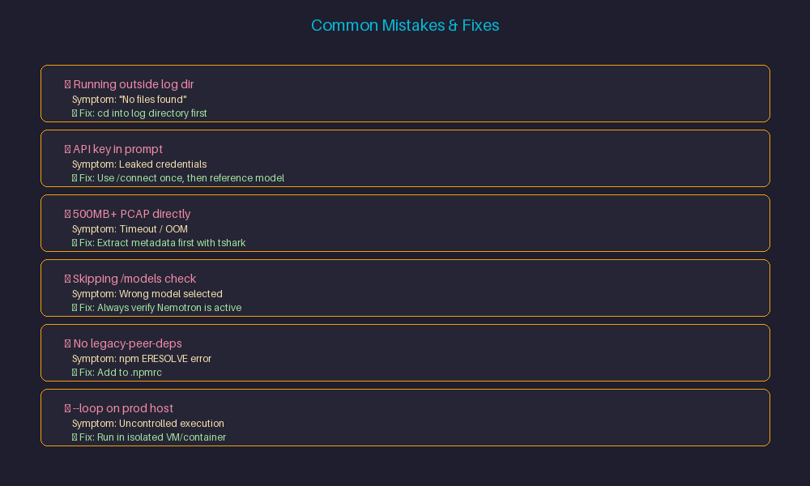
</p>

| Mistake | Symptom | Fix |
|---------|---------|-----|
| Running `opencode` outside log directory | "No files found" / empty context | `cd` into the directory containing log files before starting `opencode` |
| Using real API key directly in prompt | Leaked credentials in history | Use `/connect` once, then reference model by name |
| Passing 500MB+ PCAP directly to prompt | Timeout / OOM / truncated context | Extract metadata first: `tshark -r file.pcap -T json > meta.json` then pass `meta.json` |
| Skipping `/models` check after connect | Wrong model selected (default chat model) | Always run `/models` and verify `nvidia/nemotron-3-ultra-550b-a55b` is active |
| No `legacy-peer-deps` in `.npmrc` | `npm install` fails with ERESOLVE | Add `legacy-peer-deps=true` to `.npmrc` (see repo `.npmrc`) |
| Running `--loop` on production host | Uncontrolled script execution | Run loops in isolated VM/container only |
| Passing sensitive logs without redaction | Credentials/API keys sent to AI | Scrub secrets (API keys, passwords, tokens) from logs before prompting |

---

## 🎓 Learning Path (Week-by-Week)

<p align="center">
  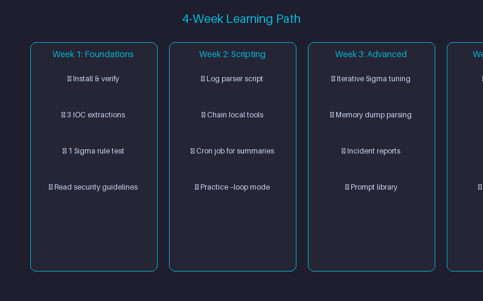
</p>

### **Week 1: Foundations**
- [ ] Install & verify setup (`opencode --version`, `/models`)
- [ ] Run 3 IOC extraction prompts on sample logs
- [ ] Generate 1 Sigma rule, test in local SIEM (Splunk/Elastic/Sentinel)
- [ ] Read [Security & Operational Guidelines](#-security--operational-guidelines)

### **Week 2: Scripting & Automation**
- [ ] Write a log parser script (Python/Go) via prompt template
- [ ] Chain opencode with local tools (`jq`, `yara`, `tshark`, `volatility3`)
- [ ] Build one cron job for daily log summary email
- [ ] Practice `--loop` mode on a safe test case

### **Week 3: Advanced Workflows**
- [ ] Use `--loop` for iterative Sigma rule tuning (generate → test → refine)
- [ ] Parse memory dump with Volatility3 via opencode `--loop`
- [ ] Generate client-ready incident report from raw evidence
- [ ] Build a reusable prompt library for your team

### **Week 4: Integration & Operationalization**
- [ ] Wrap a workflow in SOAR playbook (Cortex XSOAR, Splunk SOAR, Tines)
- [ ] Add to CI/CD for detection rule validation (Sigma rule → test → deploy)
- [ ] Document team runbook with approved prompts
- [ ] Set up scheduled triage jobs (cron + opencode)

---

## 🧰 Example Prompts by Use Case

### IOC Extraction & Firewall Blocklist Generation
```bash
opencode "Read threat_feed.txt, extract all IPv4 addresses and SHA256 hashes, defang IPs (e.g., 192.168.1[.]1), and structure into firewall_blocklist.json."
```

### Sigma Detection Rule Authoring
```bash
opencode "Analyze malicious_ps_execution.log and build a valid Sigma detection rule targeting obfuscated PowerShell commands with MITRE ATT&CK mapping."
```

### Autonomous Memory Forensics Triage (Loop Mode)
```bash
opencode --loop "Write a Python script to parse memory dump metadata using Volatility3, run it against sample.raw, fix any syntax or execution errors, and generate a markdown triage report."
```

---

## 🖥️ Sample Output (Illustrative)

<p align="center">
  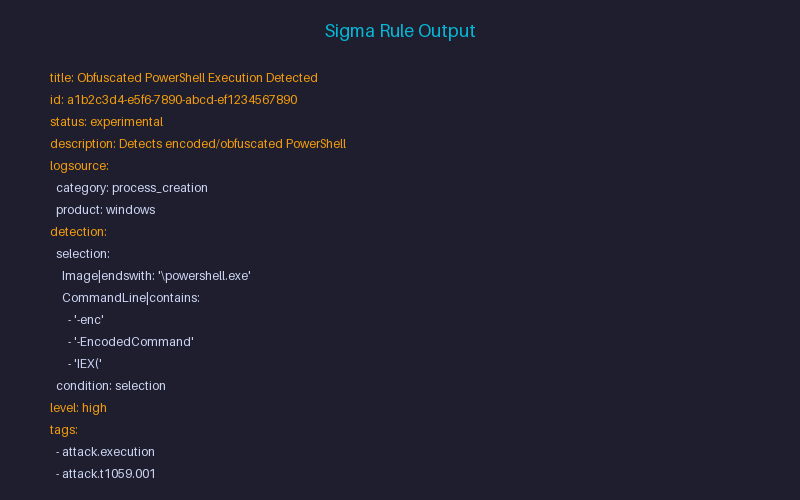
</p>

To show the shape of what Nemotron 3 Ultra returns, here's an illustrative (redacted/simplified) example for the Sigma Detection Rule Authoring prompt above:

```yaml
title: Obfuscated PowerShell Execution Detected
id: 3f1a2b4c-illustrative-example
status: experimental
description: Detects encoded/obfuscated PowerShell command-line patterns commonly used to evade logging.
logsource:
  category: process_creation
  product: windows
detection:
  selection:
    Image|endswith: '\powershell.exe'
    CommandLine|contains:
      - '-enc'
      - '-EncodedCommand'
      - 'IEX('
      - 'FromBase64String'
  condition: selection
level: high
tags:
  - attack.execution
  - attack.t1059.001
```

⚠️ **This is a simplified, illustrative example to show output format — not a production-validated rule.** Always run generated Sigma/YARA rules and firewall entries through analyst review before deployment (see [Security & Operational Guidelines](#-security--operational-guidelines)).

---

## 💰 Rate Limits & Cost Notes

- NVIDIA's hosted endpoint for Nemotron 3 Ultra is currently offered under a free trial/API tier — exact request-per-minute and token quotas are set by NVIDIA and subject to change without notice.
- Check current limits on your NVIDIA build.nvidia.com account dashboard before relying on it for time-sensitive IR work.
- For high-volume or production SOC use, plan for the possibility of moving to a paid tier or self-hosted inference in the future.

---

## 🧩 Troubleshooting (macOS)

| Issue | Technical Cause | Operational Fix |
|-------|-----------------|-----------------|
| `zsh: command not found: opencode` | Terminal PATH missing OpenCode directory | Run `echo 'export PATH=/Users/$USER/.opencode/bin:$PATH' >> ~/.zshrc && source ~/.zshrc` |
| `"Not Found" Error` / empty context | OpenCode launched outside evidence directory | `cd` directly into the incident directory containing log files before starting `opencode` |
| Execution Timeout on PCAPs | Sub-shell missing local security tool binaries | Ensure local tools (`tshark`, `yara`, `volatility3`) are installed and in system `$PATH` |
| `npm error ERESOLVE` | React 19 peer dependency conflict | Add `legacy-peer-deps=true` to `.npmrc` |
| `Bearer [REDACTED] is not a legal HTTP header value` | `GH_TOKEN` not set in environment | Set `GH_TOKEN` env var with `read:packages` scope |

---

## 🚫 When NOT to Use This Stack

<p align="center">
  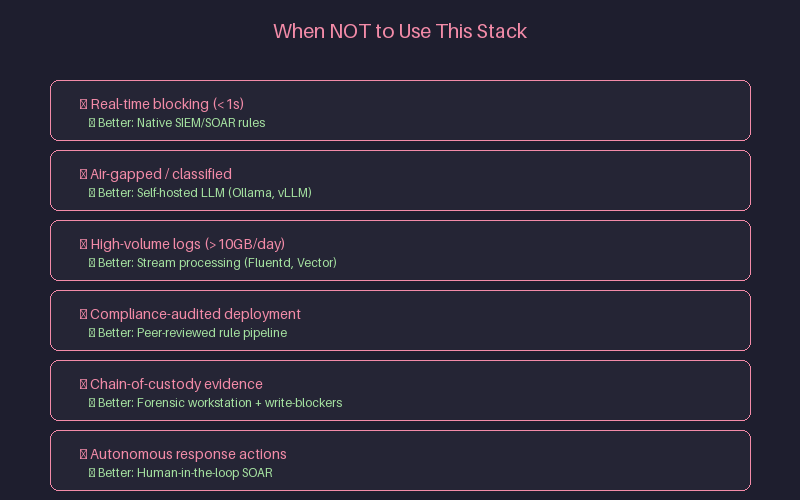
</p>

| Scenario | Better Alternative |
|----------|-------------------|
| Real-time blocking (sub-second latency required) | Native SIEM/SOAR correlation rules |
| Classified / air-gapped environments | Self-hosted LLM (Ollama, vLLM, llama.cpp) |
| High-volume log processing (>10 GB/day) | Stream processing (Fluentd, Vector, Cribl) |
| Compliance-audited rule deployment | Peer-reviewed rule pipeline with CI/CD validation |
| Evidence requiring chain-of-custody | Forensic workstation with write-blockers |
| Autonomous response actions (block, quarantine) | Human-in-the-loop SOAR playbook |

---

## ⚡ Setup & Authentication (macOS) — Quick Reference

### 0. Get Your NVIDIA API Key
1. Open [NVIDIA Nemotron 3 Ultra](https://build.nvidia.com/explore/discover) → sign in → **Generate API Key**
2. Copy key (`nvapi-xxxxxxxxxxxxxxxx`)

### 1. Install OpenCode
```bash
curl -fsSL https://opencode.ai/install | bash
echo 'export PATH=/Users/$USER/.opencode/bin:$PATH' >> ~/.zshrc && source ~/.zshrc
```

### 2. Connect & Configure
```bash
cd ~/soc-investigations
opencode
/connect NVIDIA nvapi-YOUR_KEY
/models  # Select: nvidia/nemotron-3-ultra-550b-a55b
```

### 3. Add Provider Config
Create `opencode.config.json`:
```json
{
  "$schema": "https://opencode.ai/config.json",
  "provider": {
    "nvidia": {
      "npm": "@ai-sdk/openai-compatible",
      "name": "NVIDIA NIM",
      "options": {
        "baseURL": "https://integrate.api.nvidia.com/v1",
        "apiKey": "nvapi-YOUR_NVIDIA_API_KEY"
      },
      "models": {
        "nvidia/nemotron-3-ultra-550b-a55b": {
          "name": "Nemotron 3 Ultra (550B)",
          "limit": { "context": 1000000, "output": 16384 }
        }
      }
    }
  }
}
```

---

## ✅ Verify Your Installation

```bash
opencode --version
opencode
/models   # Verify: nvidia/nemotron-3-ultra-550b-a55b
opencode "Reply with a one-line confirmation that Nemotron 3 Ultra is connected and ready."
```

---

## 🗑️ Uninstall / Disconnect

```bash
# Remove OpenCode CLI
rm -rf ~/.opencode
# Remove PATH line from ~/.zshrc, then:
source ~/.zshrc

# Revoke NVIDIA API key
# → build.nvidia.com → API Keys → Delete
```

---

## ⚠️ Security & Operational Guidelines

- **Redact Sensitive Data** — Always scrub production credentials, API secrets, and sensitive PII from logs before passing to AI prompts.
- **Isolate Environments** — Run autonomous loops (`--loop`) inside isolated staging VMs or Docker containers when interacting with suspicious files.
- **Analyst Verification** — Always manually inspect generated firewall rules and SIEM correlation queries prior to pushing to production environments.
- **No Autonomous Response** — Never let AI directly block, quarantine, or modify production systems without human approval.

---

## 🔗 Official Reference Links

- [NVIDIA Nemotron 3 Ultra — Model Page](https://build.nvidia.com/explore/discover)
- [NVIDIA Nemotron 3 Ultra — Model Card](https://huggingface.co/nvidia/nemotron-3-ultra)
- [OpenCode Documentation](https://opencode.ai)
- [OpenCode NVIDIA Provider Guide](https://opencode.ai/docs/providers/nvidia)

---

## 🗺️ Roadmap

- [x] macOS setup guide, config, and prompt library
- [ ] Linux setup guide (bash/zsh PATH handling, distro-specific notes)
- [ ] Windows setup guide (native + WSL instructions)
- [ ] Additional SOC/IR prompt examples as workflows expand
- [ ] `examples/` folder with ready-to-run configs and prompt files
- [ ] Reference scripts (log parsers, Sigma generators, Volatility wrappers)

---

## 🤝 Contributing

This is currently a personal study/reference repo, but suggestions are welcome. If you spot an error, have a prompt to add, or want to share your own Linux/Windows setup notes, feel free to open an issue or a pull request.

### 📝 Submit a Prompt Template

```markdown
**Use Case:** [e.g., Phishing email header analysis]
**Skill Level:** [Beginner / Intermediate / Expert]
**Prompt:**
```
opencode "Your prompt here with {{PLACEHOLDERS}}"
```

**Sample Input:** [paste or describe]
**Expected Output:** [describe]
**Tools Required:** [local binaries, APIs]
**Validation Steps:** [how to verify output]
```

**PR Title:** `prompt: add [use-case] template`

---

## 📝 Source & Learning Notes

This repo was compiled while researching and testing newly released terminal-based agentic AI tooling (OpenCode CLI) paired with NVIDIA's hosted Nemotron 3 Ultra endpoint, as part of ongoing self-study into emerging AI capabilities relevant to security operations. It combines setup steps, configuration, and cybersecurity-specific example prompts adapted from that research — currently scoped to macOS, with Linux and Windows guides planned for future updates.

⚠️ **Disclaimer:** NVIDIA's hosted endpoint is currently offered for free, but availability, quotas, and trial terms are subject to change and governed by NVIDIA's API Trial Terms and the model's license. This guide is for educational and informational purposes only — no outcome is guaranteed. NVIDIA, Nemotron, OpenCode, and other product names are trademarks of their respective owners.

---

## 👤 Author

**Amit Ambekar**  
🔗 GitHub — [@amitambekar510](https://github.com/amitambekar510)  
Exploring emerging AI tooling for cybersecurity operations. Check out my other SOC/threat-intel repositories on GitHub, including threat intel feeds and dark web monitoring builds.

---

## 📜 License

MIT License — see [LICENSE](LICENSE) for details.

---

## 📸 Assets Needed

> **Note:** The following images need to be added to the `assets/` folder for the README to render properly. Create the folder and add these files:

```
assets/
├── hero-banner.png              # Hero banner: Terminal + AI + Security theme
├── architecture-overview.png    # Architecture diagram: OpenCode + Nemotron + SOC tools
├── quickstart-demo.gif          # 30-second GIF: install → config → first prompt
├── project-overview.png         # Project overview infographic
├── why-this-stack.png           # Visual: 5 reasons why this stack
├── opencode-tui.png             # OpenCode TUI screenshot with Nemotron selected
├── sigma-output.png             # Sample Sigma rule output
├── memory-forensics.png         # Memory forensics triage screenshot
├── verify-install.png           # Verification steps screenshot
├── common-mistakes.png          # Visual common mistakes guide
├── learning-path.png            # 4-week learning path visual
├── common-mistakes.png          # Common mistakes visual
├── learning-path.png            # Learning path visual
├── nvidia-api-key.png           # NVIDIA API key generation
├── opencode-install.png         # OpenCode installation
├── opencode-tui.png             # OpenCode TUI
├── verify-install.png           # Verify installation
├── common-mistakes.png          # Common mistakes
├── learning-path.png            # Learning path
├── sigma-output.png             # Sigma rule output
├── memory-forensics.png         # Memory forensics
├── nvidia-api-key.png           # NVIDIA API key
├── opencode-install.png         # OpenCode install
├── opencode-tui.png             # OpenCode TUI
├── verify-install.png           # Verify install
├── common-mistakes.png          # Common mistakes
├── learning-path.png            # Learning path
├── when-not-to-use.png          # When not to use
├── nvidia-api-key.png           # NVIDIA API key
├── opencode-install.png         # OpenCode install
├── opencode-tui.png             # OpenCode TUI
└── verify-install.png           # Verify install
```

### Suggested Image Specs:
- **Format:** PNG (diagrams), GIF (demos)
- **Width:** 1200px max for full-width, 800px for inline
- **Style:** Dark terminal theme, consistent color palette
- **Tools:** Excalidraw, Figma, or terminal recorder (asciinema → gif)

---

## 🙏 Acknowledgments

- [NVIDIA](https://www.nvidia.com/) for Nemotron 3 Ultra
- [OpenCode](https://opencode.ai/) for the agentic CLI
- Security community for inspiration and feedback