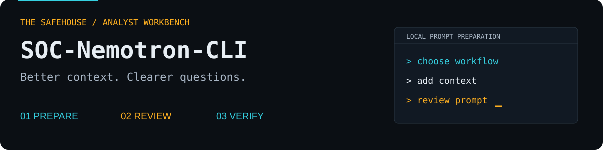

# SOC-Nemotron-CLI

<p align="center"></p>

**A practical prompt workbench and operating guide for AI-assisted security investigations.** Prepare prompts locally, use your configured NVIDIA Nemotron model through OpenCode, and verify the output against your evidence.

[Open the workbench](#local-prompt-workbench) · [Configure OpenCode](#connect-opencode) · [Prompt library](examples/prompts) · [Platform notes](PLATFORM_SUPPORT.md) · [Contribute](CONTRIBUTING.md)

## Choose how to work

| Experience | What it does | What you need |
| :--- | :--- | :--- |
| **Local prompt workbench** | Guided fields, sample inputs, prompt preview, copy and Markdown download | Python 3.10+ and a modern browser |
| **OpenCode terminal** | Run reviewed prompts against evidence in your workspace | OpenCode and a configured model/provider |
| **OpenCode web** | OpenCode's own graphical interface for AI sessions | Same provider setup as the terminal |

The local workbench is a prompt preparation tool. It does not execute commands, read evidence files, collect API keys, or make model requests. Draft inputs remain in memory until the page closes; downloads are saved only when requested.

## Local prompt workbench

```bash
git clone https://github.com/amitambekar510/SOC-Nemotron-CLI.git
cd SOC-Nemotron-CLI
python3 scripts/workbench.py
```

On Windows, use `py -3 scripts/workbench.py` if `python3` is unavailable.

The launcher opens **http://127.0.0.1:8765** and serves only the workbench folder. No package installation or API key is needed for prompt preparation. Stop it with **Ctrl+C**.

1. Select IOC extraction, Sigma rule draft, network triage, memory triage, or phishing review.
2. Enter evidence and output filenames. These refer to files in your future OpenCode workspace.
3. Add an objective or investigation context where needed.
4. Review the generated prompt and the workflow-specific verification notes.
5. Copy it into OpenCode or download the prompt as Markdown.

**Try sample inputs** to explore the interface. They are filenames, not loaded evidence or analysis results. Use **Reset this workflow** to clear that workflow's draft. Switching workflows preserves drafts only for the current page session.

Alternative launch options:

```bash
python3 scripts/workbench.py --port 8766
python3 scripts/workbench.py --no-browser
python3 scripts/doctor.py
```

## Connect OpenCode

### 1. Install and verify

Follow the [official installation guide](https://opencode.ai/docs/). With a supported Node/npm installation:

```bash
npm install -g opencode-ai
opencode --version
```

### 2. Configure your provider

Create an approved investigation folder, start `opencode` there, and use its interactive commands:

```text
/connect
/models
```

In **/connect**, select NVIDIA and enter the API key in its credential prompt. In **/models**, choose a Nemotron model available to your account. Do not paste the key into a normal chat prompt.

Model availability, context limits, and pricing are provider-dependent. This repository does not guarantee a particular Ultra model ID, parameter count, free tier, or context window. See [NVIDIA's catalog](https://build.nvidia.com/explore/discover) and [OpenCode's NVIDIA instructions](https://opencode.ai/docs/providers/#nvidia).

### 3. Use the configuration example

The [example configuration](examples/opencode.config.json) uses an environment reference and asks before edits and shell commands. Copy it into your investigation folder as **opencode.json**, the project configuration filename:

```bash
# Run from this repository; replace the destination with your workspace.
cp examples/opencode.config.json /path/to/investigation/opencode.json
```

If using this environment-based configuration, make `NVIDIA_API_KEY` available to the OpenCode process through your approved secret-management method. The workbench does not need it. If using credentials saved with **/connect**, omit the example's `apiKey` override so an unset environment variable does not replace your saved authentication.

The old example used shell-style variable interpolation and unsupported top-level settings. The updated example uses OpenCode's documented `{env:NVIDIA_API_KEY}` syntax. See [configuration](https://opencode.ai/docs/config/) and [permissions](https://opencode.ai/docs/permissions/).

### 4. Run one small investigation

Use [sample.log](examples/sample.log), which contains synthetic documentation IP addresses. Copy it to the investigation folder, open `opencode`, and paste the IOC extraction prompt from the workbench.

Verify that the output references the two IP addresses actually present in the sample. A model response alone does not prove which model ran: verify the selected model in OpenCode.

For a short non-interactive request, the documented syntax is:

```bash
opencode run "Explain the difference between an observed indicator and a confirmed malicious indicator."
```

Use an interactive session when you need to review tool permission requests. This guide does not depend on the previously documented `--loop` flag.

## Graphical AI sessions

For actual model interaction in a browser, use [OpenCode Web](https://opencode.ai/docs/web/):

```bash
# Run inside your approved investigation directory.
opencode web --hostname 127.0.0.1
```

This is a separate interface from the local prompt workbench. OpenCode handles authentication, model requests, tool actions, and sessions. Paste a prepared prompt there and review its proposed actions.

## Workflow library

| Workflow | Input | Analyst review |
| :--- | :--- | :--- |
| [IOC extraction](examples/prompts/ioc-extraction.md) | Text report or log | Source references; separate observed IOCs from reputation |
| [Sigma draft](examples/prompts/sigma-rule.md) | Process events and detection objective | Schema, telemetry assumptions, positive and negative tests |
| [Network triage](examples/prompts/pcap-analysis.md) | Exported packet metadata | Capture scope, missing fields, baseline behavior |
| [Memory triage](examples/prompts/memory-forensics.md) | Existing Volatility output | Plugin provenance and corroborating evidence |
| [Phishing review](examples/prompts/phishing-analysis.md) | Email evidence | Trusted authentication headers and gateway telemetry |

The canonical catalog is [examples/workflows.json](examples/workflows.json). A generator creates both browser data and Markdown prompt files so they stay aligned.

For raw PCAPs or memory images, first use the relevant forensic tool to produce an approved text/JSON export. The workbench does not parse these formats. Defanged IOCs are suitable for reporting; they are not directly deployable firewall blocklists.

## Troubleshooting

| Symptom | Next step |
| :--- | :--- |
| Local port is occupied | Run `python3 scripts/workbench.py --port 8766` |
| Browser does not open | Open the printed loopback URL manually |
| Copy button cannot access clipboard | Use the selected preview text with Ctrl+C / Cmd+C, or download Markdown |
| Copy/download buttons are disabled | Complete all required workflow fields |
| OpenCode is not found | Verify installation and the PATH guidance from the installer |
| NVIDIA authentication fails | Check credentials in OpenCode; check whether the config overrides a saved key |
| Model is unavailable | Select an available model using `/models` |
| Evidence is not found | Confirm the filename exists in the OpenCode workspace |
| Prompt reports unexpected facts | Check source references and rerun on a smaller, reviewed sample |

## Project layout

| Path | Purpose |
| :--- | :--- |
| [workbench/dist](workbench/dist) | Local browser interface; no build dependencies |
| [scripts/workbench.py](scripts/workbench.py) | Loopback-only static launcher |
| [scripts/doctor.py](scripts/doctor.py) | Local prerequisite report; no network or secret reads |
| [scripts/build_workbench.py](scripts/build_workbench.py) | Generate browser data and Markdown templates |
| [examples/workflows.json](examples/workflows.json) | Single workflow catalog |
| [tests](tests) | Prompt-generation and launcher checks |
| [docs/OPERATIONS.md](docs/OPERATIONS.md) | First-run steps and operational review |

## Validation and contributions

```bash
python3 scripts/build_workbench.py --check
python3 -m unittest discover -s tests -p 'test_*.py'
node --test tests/workbench.test.cjs
```

The runtime needs no npm packages. Node.js 18+ is needed only for JavaScript contributor checks. See [CONTRIBUTING.md](CONTRIBUTING.md).

Automated checks cover template consistency, placeholder handling, static references, and local server boundaries. They do not validate model quality or provider access. Live NVIDIA inference and full browser/platform testing are not claimed.

## Operational use

Use approved evidence and redact secrets before sending material to a hosted model. Keep original evidence separate from generated artifacts. Review generated rules and investigation findings before applying them; suggested indicators are not automatically confirmed threats.

See [operating notes](docs/OPERATIONS.md) for a short review checklist.

## Author and license

**Amit Ambekar** · [Portfolio](https://portfolio.thesafehouse.in) · [LinkedIn](https://www.linkedin.com/in/amitmilindambekar/) · [The Safehouse](https://www.thesafehouse.in)

[MIT License](LICENSE). NVIDIA, Nemotron, and OpenCode are trademarks of their respective owners. This is an independent community project.
